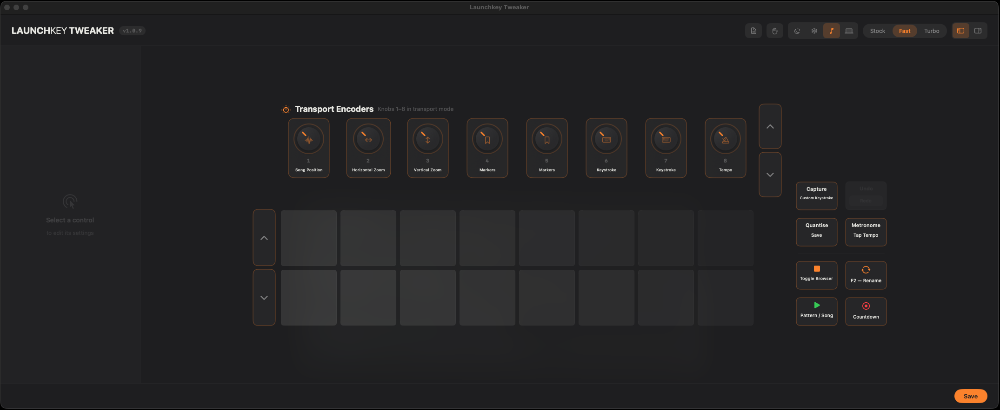

# Launchkey Tweaker

Custom transport encoder speed patch + shift button remapping for the Novation Launchkey MK4 in FL Studio on macOS.

The stock Novation scripts ignore how fast you turn transport knobs, leave 20+ shift button combos completely dead, and only map 4 of 8 encoders. Tweaker fixes all of that.

Includes a native SwiftUI config app. Changes apply live — no FL Studio restart needed after initial setup.



## Features

### Transport Encoders

All 8 transport mode knobs are configurable with velocity-sensitive speed scaling:

| Encoder | Stock Behavior | With Tweaker |
|---------|---------------|------------|
| **Knob 1** — Song Position | 1 beat per click, always | Scales with turn speed |
| **Knob 2** — Zoom | 1 zoom step per click | Scales with turn speed |
| **Knob 3–4** — *empty* | Does nothing | Configurable |
| **Knob 5** — Markers | Requires 3 clicks to jump | Instant |
| **Knob 6–7** — *empty* | Does nothing | Configurable |
| **Knob 8** — Tempo | ~1 BPM per click | Scales with turn speed |

Available knob functions: Song Position, Horizontal/Vertical Zoom, Markers, Tempo, Track Volume/Pan, Channel Volume/Pan, Swing.

### Shift Button Mappings

20+ shift button combos that Novation left unmapped, now configurable:

| Group | Buttons |
|-------|---------|
| **Transport** | Stop, Play, Record, Loop, Capture MIDI, Quantise, Metronome |
| **Navigation** | Pads up/down, Encoder up/down |

Available actions include native FL Studio API calls (Toggle Pat/Song, Save, Undo, Redo, Copy, Cut, Paste, F1–F12, etc.) and custom keystrokes for anything else (like Cmd+Shift+R to export as MP3).

### Custom Keystrokes

Send any macOS keyboard shortcut from a shift button press — including combos like Cmd+Shift+R to export. A background keystroke server handles delivery via macOS CGEvents. See [docs/custom-keystrokes.md](docs/custom-keystrokes.md) for technical details.

## Requirements

- macOS (tested on Tahoe / macOS 26)
- FL Studio with Novation Launchkey MK4 scripts installed
- Works with all MK4 sizes (25/37/49/61/88)

No Xcode or developer tools required — pre-built binaries are included.

## Installation

### 1. Clone the repo

```bash
git clone https://github.com/autreiyas/novation-launchkey-tweaker.git
cd novation-launchkey-tweaker
```

### 2. Run the installer

```bash
chmod +x install.sh restore.sh
./install.sh
```

The installer automatically:
- Backs up original Novation script files (first run only)
- Installs patched transport views, button handlers, and config loader
- Installs the keystroke server binary to `~/.tweaker/`
- Sets up a LaunchAgent so the keystroke server starts on login
- Preserves your existing `tweaker_config.json` if present
- Clears Python bytecode cache to prevent stale script issues

### 3. Restart FL Studio

FL Studio needs one restart to load the patched scripts. After that, all config changes apply live.

### 4. Open Tweaker.app

```bash
open Tweaker.app
```

Use the app to configure encoder functions, button mappings, and themes. Changes save automatically.

### 5. Enable custom keystrokes (optional)

If you want to send keyboard shortcuts (e.g., Cmd+Shift+R for export):

1. Open **System Settings → Privacy & Security → Accessibility**
2. Click **+**, press **Cmd+Shift+G**, paste `~/.tweaker/tweaker_keystroke_server`
3. Toggle it **on**
4. In Tweaker.app, make sure `enable_custom_keystrokes` is **true**
5. Assign a button to **Custom Keystroke** and set the key + modifiers

> **Note**: If you ever update the keystroke server binary (by re-running the installer after a repo update), you'll need to remove and re-add it in Accessibility settings — re-signing the binary invalidates the trust entry.

## Tweaker App

The pre-built `Tweaker.app` is included in the repo. Just double-click or `open Tweaker.app`.

To rebuild from source (requires Xcode / Swift):

```bash
cd Tweaker
swift build -c release
cp .build/arm64-apple-macosx/release/Tweaker ../Tweaker.app/Contents/MacOS/Tweaker
```

The app has two sections:
- **Transport Encoders** — knob function assignment with speed/sensitivity sliders
- **Shift Button Mappings** — button cards laid out matching hardware positions with function picker popovers and custom keystroke support

Themes: Midnight, Arctic, FL Studio, System.

Encoder presets: Stock, Fast (3x–4x), Turbo (6x–8x).

## Updating

When you pull new changes:

```bash
git pull
./install.sh
# Restart FL Studio
```

The installer only re-signs the keystroke server binary if it changed. If it didn't change, your Accessibility trust is preserved.

## Restoring Originals

```bash
./restore.sh
# Restart FL Studio
```

This restores all original Novation script files from the backup created during first install.

## Documentation

- [Custom Keystrokes](docs/custom-keystrokes.md) — architecture, setup, troubleshooting
- [Known Issues](docs/known-issues.md) — FL Studio subinterpreter limitations, Accessibility trust
- [Changelog](CHANGELOG.md) — version history

## Notes

- **Novation Components** or **FL Studio updates** may overwrite patched files — re-run `./install.sh`.
- Only transport mode encoders are affected. Mixer, plugin, and sends modes are untouched.
- The installer never overwrites your `tweaker_config.json` — your settings are safe across updates.
